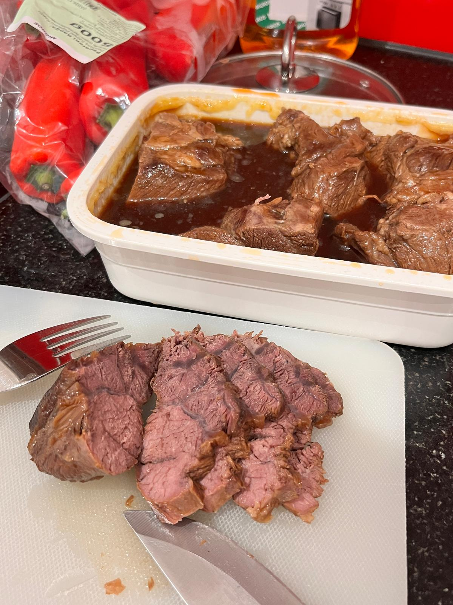

# Lanxi Braised Beef 兰溪酱牛肉

---

## 配料准备

| Ingredient 食材 | Amount 用量 | Side Note 备注 / 处理方式 |
| :--- | :--- | :--- |
| Rindschenkel/Rinderwade 牛腱子 | 1.5kg | Any cut works 各种部位都可以 |
| Water 水 | 1l | Original recipe uses 1.6l, takes way to long to condense 原配方1.6l，收汁收到死 |
| Light soy sauce 生抽 | 90g | Original recipe uses 180g, way too salty 原配方180g齁咸|
| Salt 盐 | 10g | Original recipe uses 21g, way too salty 原配方21g齁咸 |
| Shaoxing wine 黄酒 | 100g | |
| Rock sugar 冰糖 | 30g | |
| MSG 味精 | 6g | |
| Ginger 姜 | 50g | |
| Garlic 蒜 | 50g | |
| Star anise 八角 | 6 pieces | |
| Cinnamon 桂皮 | 10g | |
| Dried chili 干辣椒 | as much as you can handle 致死量，我爱吃辣 | |
| Bay leaf 香叶 | 2 pieces | |
| Fencheltee 卤料包平替 | 2 packs | The more spices you use, the richer the flavor 香料种类越多，味道越复合，可惜本人没条件|

---

## 步骤说明

1. **Blanching 焯水**

   If the beef is fresh, blanch it with boiling water. If it is the stronger-smelling Swiss beef, start from cold water instead.
   
   肉新鲜就热水下锅，但瑞士臭肉需要冷水下锅焯水。

2. **炖肉**

    Put the beef and seasonings directly into the pot in the correct ratio and braise for 1.5 hours, then reduce over high heat for about 15 minutes until only about 250ml of braising liquid remains. Let it soak so the flavor sinks in, then cool and slice 
    
    牛肉和调料按比例直接放锅里炖煮1.5h，然后大火收汁大概15min，到锅里只剩下250ml卤水。浸泡入味，放凉后再切片。