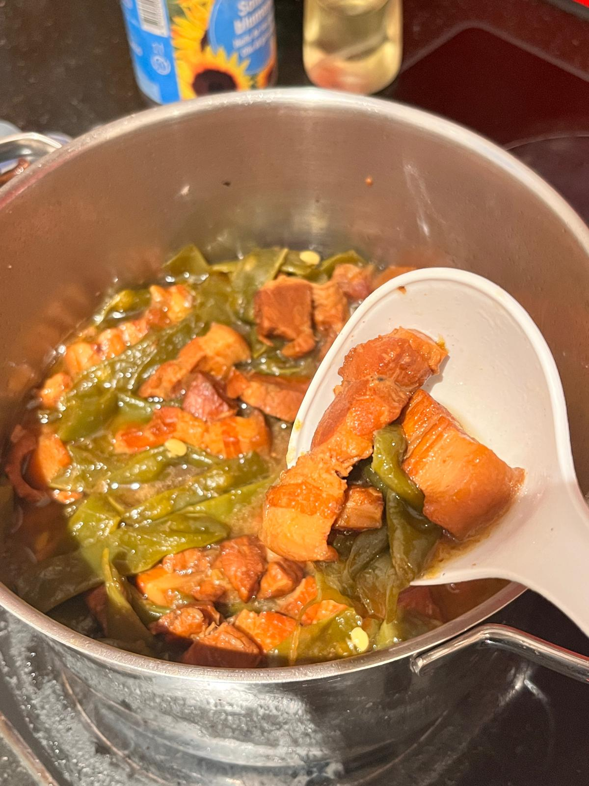
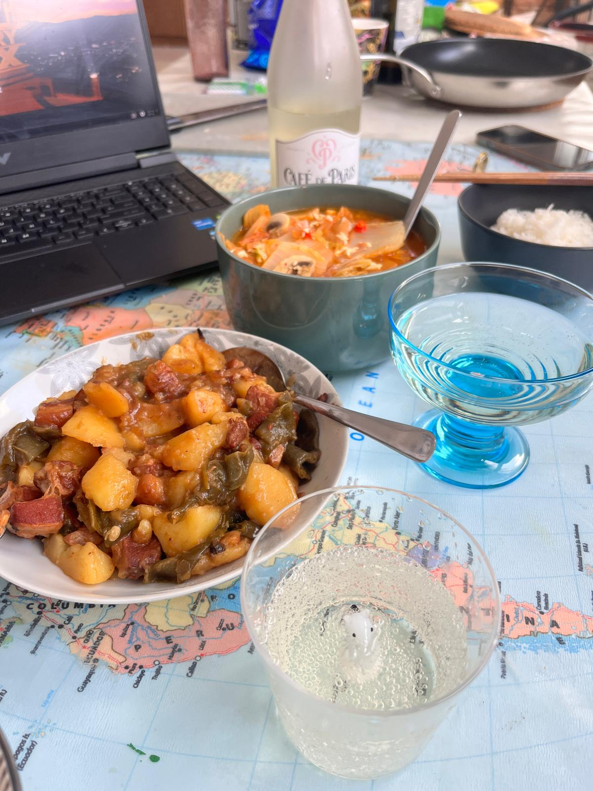

# Pork Belly with Potato and Stangenbohnen 红烧肉烧土豆豆角

---

## 配料准备

| Ingredient 食材 | Amount 用量 | Side Note 备注 / 处理方式 |
| :--- | :--- | :--- |
| Pork Belly 猪五花 | 1kg | 如果有毛要先烧一下 |
| Ginger 姜 | 5 pieces 五片 | |
| Dried Chili 干辣椒 | as much as you can handle 致死量，我爱吃辣 | |
| Stangenbohnen 豆角 | 500g | |
| Potato 土豆 | 2 两个 | |
| Fermented Red Tofu 红腐乳 | 2 spoons 两勺 | |
---

## 步骤说明

1. **Blanching 焯水**
   If you want the pieces to look neat, blanch the pork first and then cut it. Once the water start to boil, take it out, let it cool, and cut it into chunks 
   
   想要切块好看就先焯再切，水开后就可以捞出，放凉切块。
2. **Searing the Pork 煸肉**
    Add a little oil to the wok and sear the pork until it is lightly golden. Do not overdo it or the meat will be hard. The rendered fat can be used to cook the sugar color and stir-fry the beans, or save for later 
    
    锅里加一点底油，煸到略微焦黄就行，煸过了容易老。煸出来的油可以炒糖色，炒豆角，留着后续炒菜。
3. **Making the Sugar Color 炒糖色**
   Add 3 large spoons of sugar and 2 spoons of oil. When the sugar has fully melted, turn to the lowest heat. Once it starts bubbling, remove from the heat, and add water when the bubbles disappear 
   
   三大勺冰糖加两勺油，冰糖全部融化转最小火，冒泡了就离火，等到泡消失就加水。
4. **Braising 开炖**
    Put scallion, ginger, star anise, and dried chilies into the base oil. When they turn slightly golden, add the pork belly. Stir-fry a little, then add 4 spoons of light soy sauce, the sugar-color water, and enough hot water to cover the meat. Add 2 spoons of red fermented tofu juice and a pinch of salt. Simmer for 1 hour 
    
    底油放葱姜八角干辣椒，略微金黄放五花肉，炒香四勺生抽，再加糖色水和开水没过肉。加两勺红腐乳汁，一捏盐。直接开炖一个小时。
5. **Stir-frying the Beans 炒豆角**
    You can stir-fry the beans while the meat is braising. Use oil to soften them, and optionally sear the potatoes as all  
    
    可以在炖肉的时候炒，用油煸软豆角，也可以把土豆煸一下
6. **Getting Ready to Eat 准备开吃**
    When the time is almost up, skim off the excess oil, then add the potatoes and beans. As you reduce the sauce over high heat, scoop out the whole spice bits 
    
    差不多时间就放土豆豆角，最后大火收汁时捞一下大料渣。

