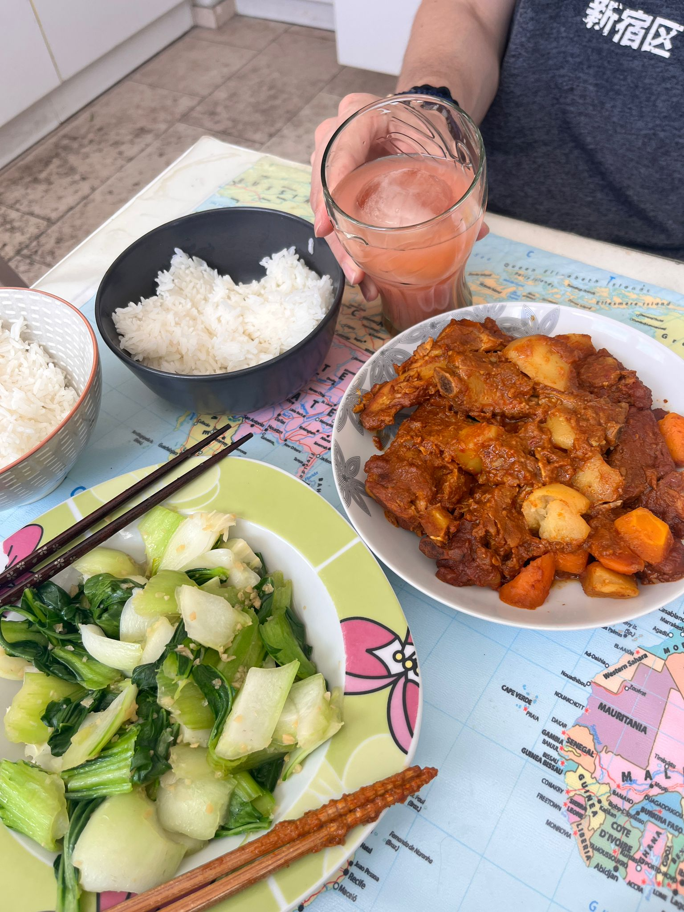

# Spicy Curry Ribs 辣咖喱排骨

---

## 配料准备

| Ingredient 食材 | Amount 用量 | Side Note 备注 / 处理方式 |
| :--- | :--- | :--- |
| Pork ribs 猪肋排 | 1kg | |
| Potato 土豆 | 2 两个 | |
| Carrot 胡萝卜 | 2 两根 | |
| Apple 苹果 | 1/2 半个 | for sauce 酱料 |
| Onion 洋葱 | 1/2 半个 | for sauce 酱料|
| Ginger 姜 | 1 piece 一片 | for sauce 酱料|
| Garlic 大蒜 | 7 cloves 七瓣 | for sauce 酱料|
| Rice wine 料酒 | 1 spoon 一勺 | for sauce 酱料|
| Light soy sauce 生抽 | 6 spoons 六勺 | for sauce 酱料|
| Sugar 白糖 | 1 spoon 一勺 | for sauce 酱料|
| Korean red chili paste 韩式辣酱 | 1.5 spoons 一勺半 | for sauce 酱料|
| Chili powder 辣椒粉 | 2 spoons 两勺 | for sauce 酱料|
| Curry powder 咖喱粉 | 2 spoons 两勺 | for sauce (omit for plain spicy stewed ribs) 酱料（不放就是普通辣炖排骨）|
| Sesame oil 芝麻香油 | 1 spoon 一勺 | for sauce 酱料|

> 💡 **Note**：You can also substitute the ribs with beef brisket; just increase the braising time accordingly 同样也可以把排骨换成牛腩，要相应增加炖煮时间。

---

## 步骤说明

1. **Making the Sauce 制作酱料**

   Blend all the sauce ingredients until very smooth and fine. You can first blend those ingredients up until soy sauce and mix it with the rest after blending.
   
   把备注酱料的配料都放在绞肉机里打成泥，越细腻越好，生抽后的调料可以搅打完再混合均匀。

2. **Braising 炖煮**

    Add the blanched ribs and sauce to a pot with some scallion or onion. Braise for 30 minutes. After 30 minutes, add the carrots and potatoes. Finally, reduce on high heat to concentrate the sauce and ensure the ribs are flavorful — irresistibly delicious! I freestyled with a spoon of Chi Hou sauce and a spoon of peanut butter, but it doesn't make much difference to me.
    
    焯过水的排骨和酱料一起倒在锅里，再加点大葱或洋葱，直接先炖半个小时。半个小时后放胡萝卜和土豆。最后大火收汁保证排骨入味，无敌美味！我还freestyle了一勺柱候酱和一勺花生酱，但感觉没啥区别。