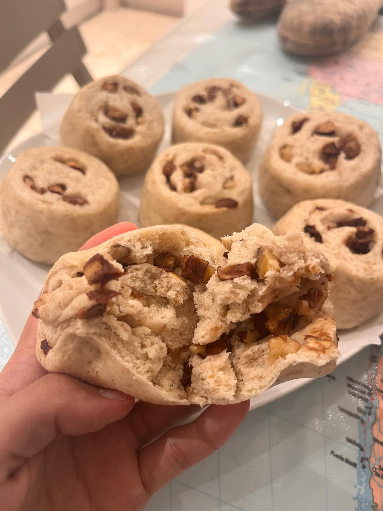
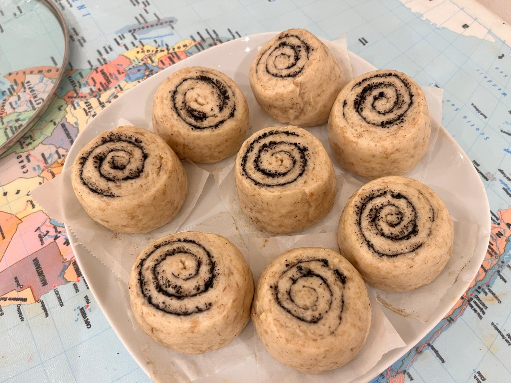
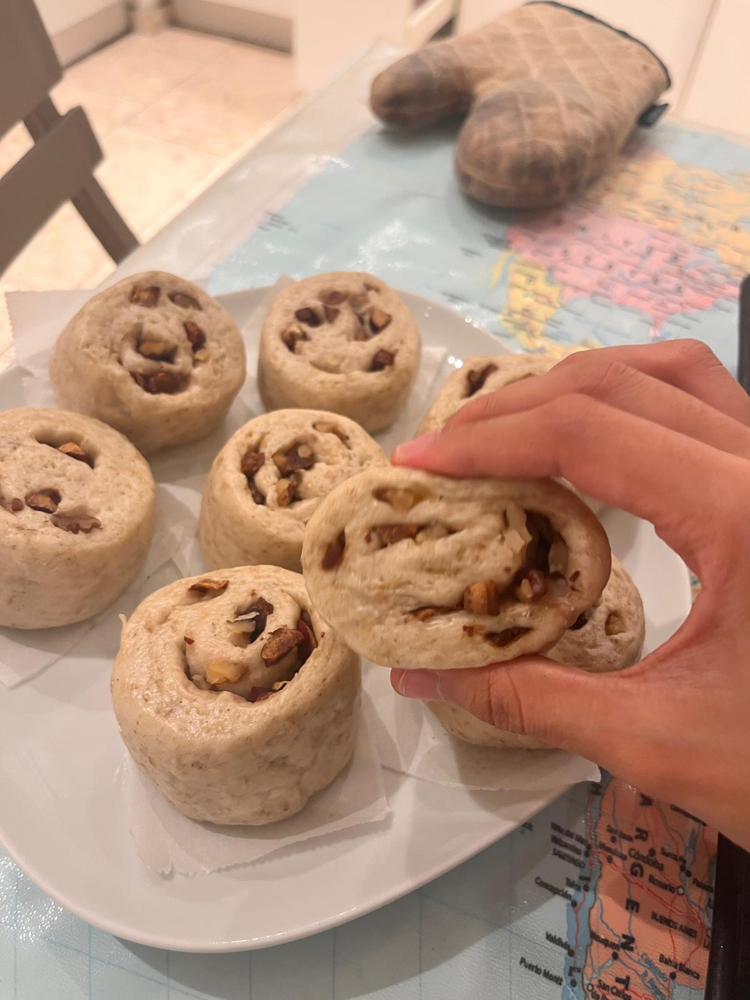

# Mantou Roll 馒头卷

## 馅料口味
The dough is the same for all versions; only the filling changes. So far I have come up with two flavors: red date and walnut mantou rolls (the filling is just dried red dates and chopped walnuts) 

面团都是一样的，就是馅料可以自选。暂时研发出两种口味：红枣核桃馒头卷（馅料就是干红枣和核桃碎）

And a black sesame mantou roll (the filling uses cooked black sesame powder mixed with a little milk into a spreadable paste; it should not be runny) 

还有黑芝麻馒头卷（馅料用熟黑芝麻粉加一点点牛奶和成好涂抹的泥状，不能稀）

---

## 配料准备

| Ingredient 食材 | Amount 用量 | Side Note 备注 / 处理方式 |
| :--- | :--- | :--- |
| All-purpose flour 中筋面粉 | 300g | |
| Yeast 酵母 | 3g | |
| Oats 燕麦 | 100g | Optional, only if you like it 个人喜欢，可以不加 |
| Water 水 | 150g | Approximate 大概，具体看面团状态 |
---

## 步骤说明

1. **Oat Preparation 泡燕麦**

   If you do not want oats, skip this step. Soak the raw oats in boiling water until softened, then let them cool slightly 
   
   （如果不想放燕麦就省略）生燕麦开水泡软，略微放凉。
   
2. **Dough 和面**

    I am a lazy person, and lazy people have their own methode! First add water in the flour and soaked oats slowly. If you add oats, use a little less water. Play with the dough until it comes a whole, put it in the fridge to rest for 20 minutes. Knead it briefly, then put it back in the fridge again to rest for another 20 minutes. The exact time depends on the dough and temperature; as long as it can be stretched long easily, and feels very, it is good to go. Late-yeast fermentation means adding the yeast after the dough has already been kneaded: mix the yeast with a little water into a paste, spread it into the dough, and knead until evenly incorporated.

    我是懒狗，懒狗只做后酵母一发面食！先把面粉加燕麦，慢速倒水，如果加了燕麦就要少加水。下手揉面絮，成团后放进冰箱醒面二十分钟。水和好后拿出来稍微揉一下，再放近冰箱醒二十分钟。具体时间长短看面团状态和气温，只要有一定延展性，非常软又好rua就行。后酵母发就是把酵母在揉好面之后加进去，稍微用一点点水和成泥，涂近面团里面，再揉均匀。

3. **Shaping 整形**

   Roll the dough out into a sheet. A slightly thinner sheet makes prettier layers. Spread the filling on top, roll it up, and thin the seam a little so it seals better. Cut it into cute little buns. Use the scraps to fill a bottle cap so you can watch the proofing progress 
   
   摊成面片，稍微薄一点卷起来更有层次，把馅料铺上去，再卷起来，接口的地方稍微擀得薄一点，切成可爱的小胖墩子。用边角料填一个瓶盖来观察发酵状态。
   
4. **Proofing 发酵**

    Proof for about 40 minutes. The dough in the bottle cap should have risen to about 1.5 times its height, and the dough should feel light and full with air when you touch and lift it.
    
    大概发酵四十多分钟，瓶盖里的面团鼓起到1.5倍高，面团掂起来轻飘飘的感觉确实气就没毛儿了！

5. **Kill the Mantous 烫死它们**

    If you steam them starting from cold water, the dough can proof a little more while the water heats up. Steam for 15 minutes, then let them sit covered for 3 minutes, and they are ready to eat 
    
    凉水上锅蒸的话可以再促进发酵一会儿，蒸十五分钟焖三分钟就可以开吃啦！

