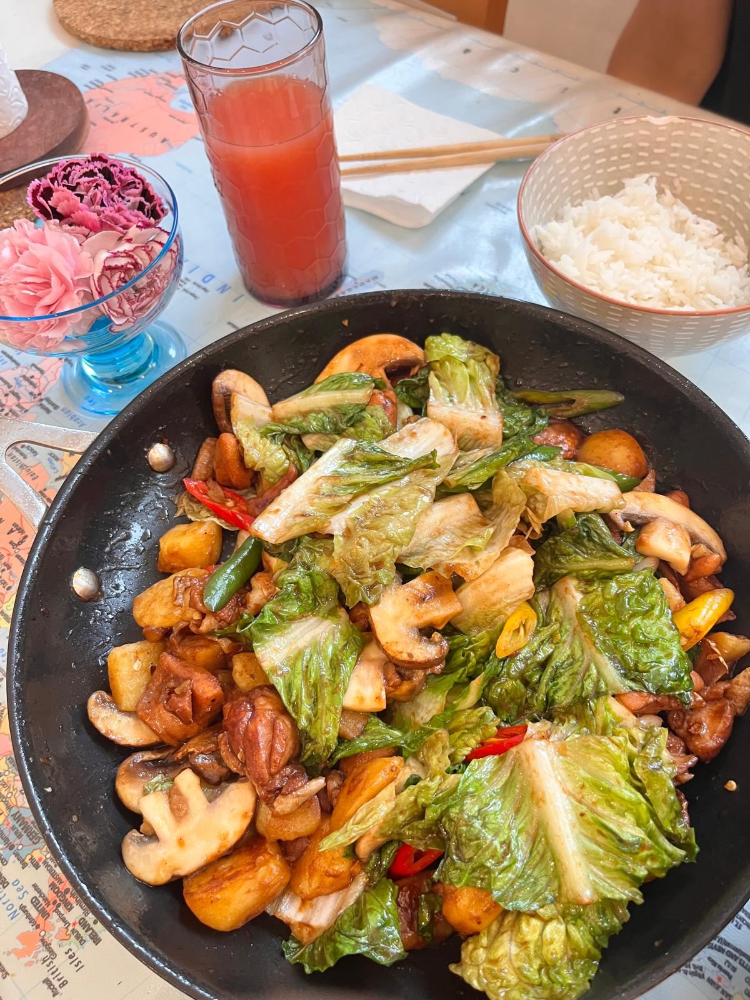
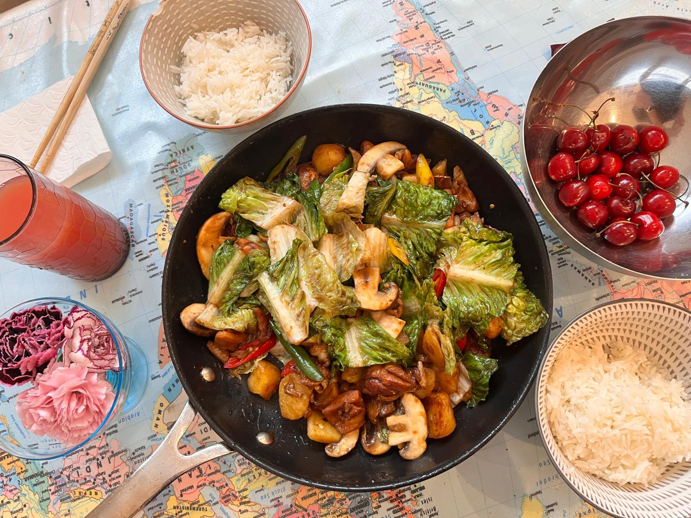

# 鸡公煲

---

## 配料准备

| Ingredient 食材 | Amount 用量 | Side Note 备注 / 处理方式 |
| :--- | :--- | :--- |
| Chicken 鸡肉 | 500g (~ two legs 大概两个鸡腿) | in one-bite pieces 切中块 |
| Ginger 姜 | 3 pieces 三片 | |
| Garlic 蒜 | 5 pieces 五瓣 | |
| Mushroom 蘑菇 | 3 三朵 | |
| Potato 土豆 | 2 两个 | |
| red&green paper 青红椒 | 2 两个 | |
| Chi Hou sauce 柱候酱 | 1 table spoon 一大勺 | **Must have 必不可少**|
| Hoisin sauce 海鲜酱 | half table spoon 半勺 |  |
| Hotpot paste 火锅底料 | 1/6 piece 六分之一块 | not too much 味儿不能太大 |

> 💡 **Note**：Feel free to add anything you like, e.g. meatballs, tofu, or other vegetables besides potato and mushroom. 还可以加肉丸，豆腐，蔬菜等，小馋猫，你就吃吧。

---

## 步骤说明

1. **Marinate 腌制**
   Marinate the chicken with 1 TB Chi Hou sauce 一大勺柱候酱, 1/2 TB hoisin sauce 半勺海鲜酱, 1 bay leaf 一片香叶, 5 Sichuan peppercorns 五粒花椒, 1 teaspoon thirteen-spice blend 一捏王守义都说好的十三香, 1 TB oyster sauce 一大勺耗油, and 1/2 TB dark soy sauce 半勺老抽. Finish with a little oil 封一点油. Let it rest for 20 minutes 腌制二十分钟。
2. **Kill the Chicken 炒鸡**
   Heat some oil in a wok or pot. Once the oil is hot, add the ginger slices and hotpot paste. When the ginger turns golden, add the chicken and stir-fry for about 5 minutes. Add the garlic and potatoes, cook for a bit, then pour in a small amount of water. You only need enough water to braise the potatoes; a drier pot tastes better. When the potatoes are almost done, add any other ingredients you want.

   起锅烧油，油热后下入姜片和火锅底料，姜煎至焦黄放鸡，炒五分钟，加蒜和土豆炒一会儿再加一点清水，水够焖土豆就行，干锅好吃一点。土豆差不多熟了放想吃的配菜。然后您就吃吧，一吃一个不吱声！一吃一个不吱声！

